- [Business Goal](#business-goal)
- [Technical Goal](#technical-goal)
- [Working in Development](#working-in-development)
- [Provisioning Hosting, Backend and Deployment](#provisioning-hosting-backend-and-deployment)


## Business Goal

When a logged out user visits the web-app, they can see a screen full of bananas.
and when they hover over banana they will see the hashnode username of the person posting the banana

When a user clicks on Sign up they can create an accounts with an email, password and hashnode username.

When a user is logged in, they can left click to place upto 6 bananas onto the screen.
When the right click it will remove a banana. It would be nice to see bananas appear in real time.

## Technical Goal

Build a simple web-application that utilizes as much of the AWS Amplify Console using no javascript frameworks.

### Considersations

- Backend — The backend is built manually using the AWS Amplify Console Admin UI
- Hosting — The frontend is hosted via the AWS Amplify Console
- Frontend — The frontend is written in ES6 javascript, Scss and the Amplify Client, it was designed to be a simple use case to use Amplfiy without any javascript frameworks.

## Working in Development

### Install Required Packages

```
npm i
```

### Running Local Web-server

Start the webpack development server.

```
npm start
```

Visit the url [http://localhost:8080/](http://localhost:8080/)

## Provisioning Hosting, Backend and Deployment

### 1. Getting Started (Setting up Frontend Hosting)

#### 1.1 Host your web-app

We want to use AWS Amplify both for hosting our frontend and creating our backend via the Admin UI.
We will select `Get Started` for Host your Web app


#### 1.2 Choose existing frontend from Github Repo

We are going to choose Github


#### 1.3 Authorize and Connect

Authorize Github access by logging into your Github Account.
Choose the repo. In this case, for me it is omenking/banana-brigade


#### 1.4 Name app and proceed

We'll name our app banana-brigade. Our repo doesn't have amplify build
file. No worries since we'll just go with the default settings and
proceed forward


#### 1.5 Save and deploy

Save and deploy, wait a little bit


#### 1.6 Wait for the frontend to deploy

Once deployed, AWS Amplify will be being to deploy the frontend.
Wait for it to complete it deploy.
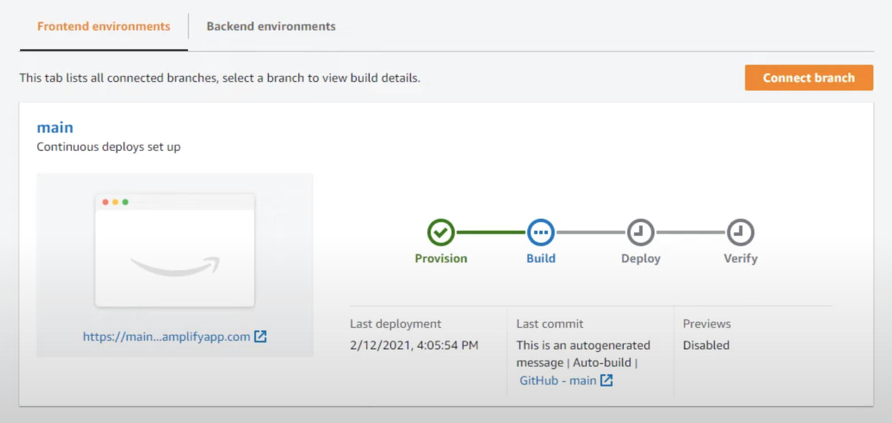

Now we can procced to creating our backend.

### 2. AWS Amplify Admin UI (Setting up Backend Infrastructure)

#### 2.1 Setup Backend

In the AWS Amplify console you need to go to Backend enviroments tab and
click getting started

> Warning, if you go to Admin management UI and turn on the Admin UI
> from here it will not work, its just a confusing part of the UX.

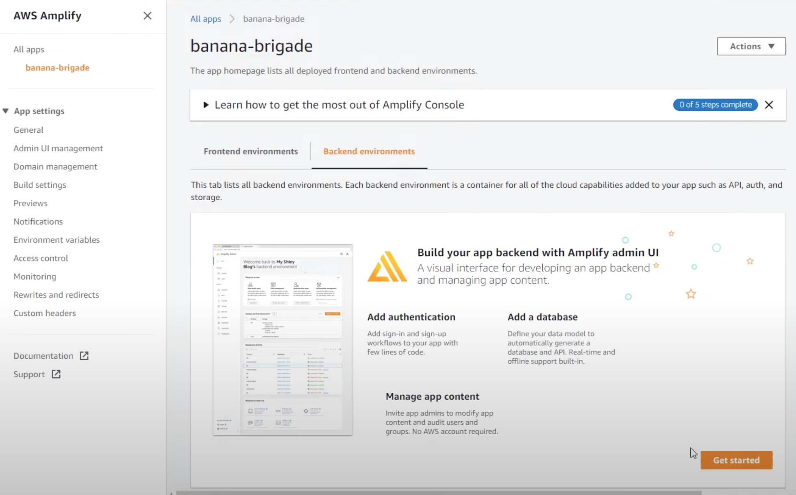

#### 2.2 Wait for AWS Amplify Console to provision Admin UI

Just wait a while here while AWS setups Admin UI for your use.
Admin UI is a seperate application to provision AWS Infrastructure.

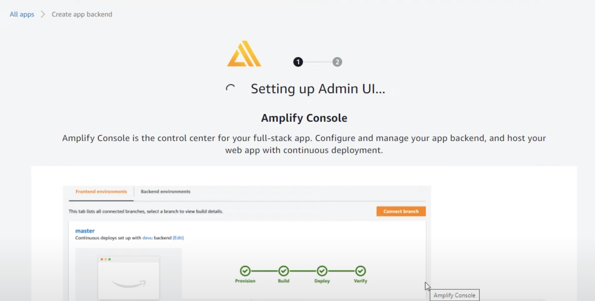

#### 2.3 Open Admin UI

Once the Admin UI is provisioned you can launch it by going to Backend
enviroment and choosing Open Admin UI

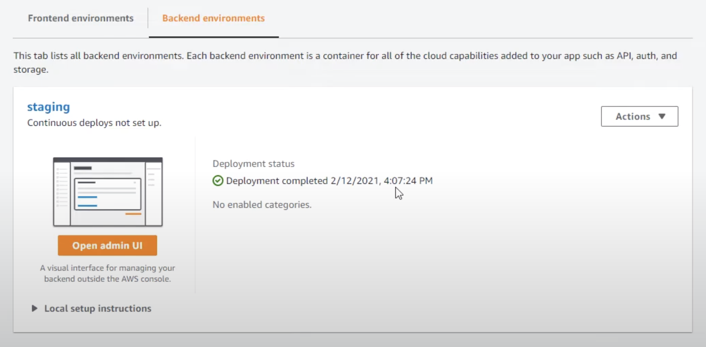

#### 2.4 Create Data Model

We are going to want to store our banana data in DynamoDB.
Go to `Data` and choose to create a `Model`

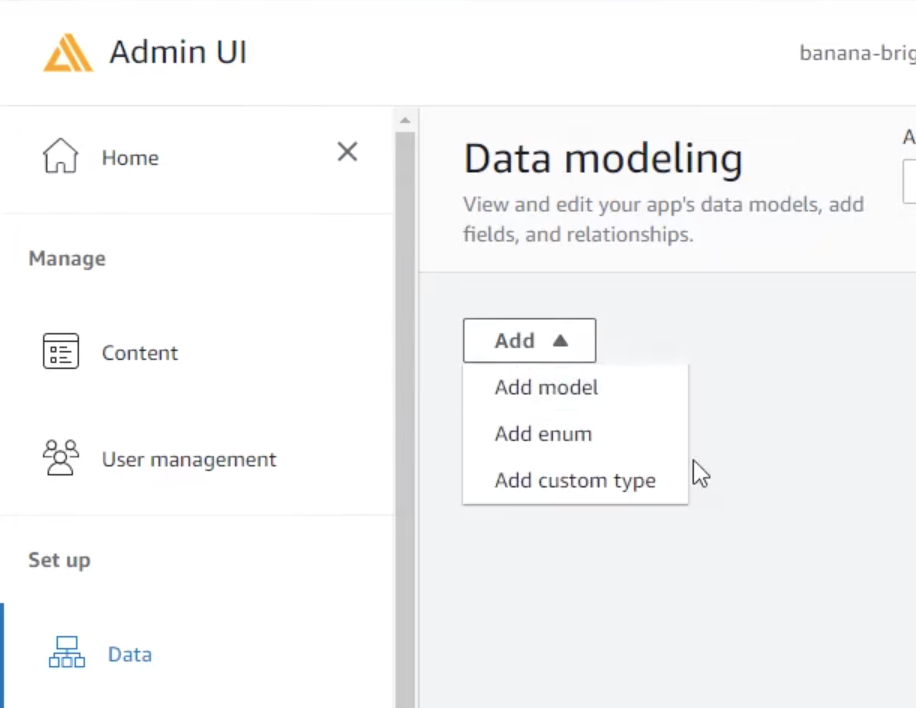

Name our model Banana with the following fields:

- `vector` will store a json object containing our X, Y and Z coordinates of the user's banana
- `cognito_uuid` will store the unique id generated for each cognito user

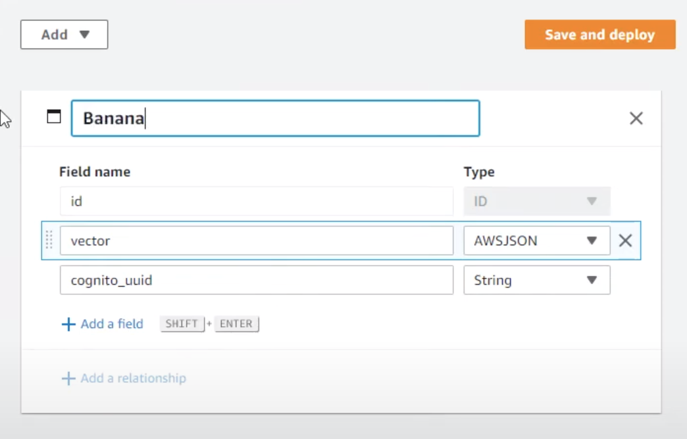

Click Save and Deploy, and cofirm again by pressing deploy

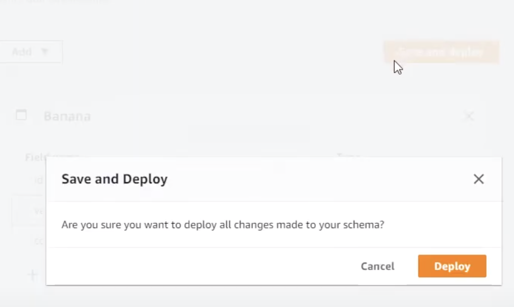

Wait for you data model to finish deploying.

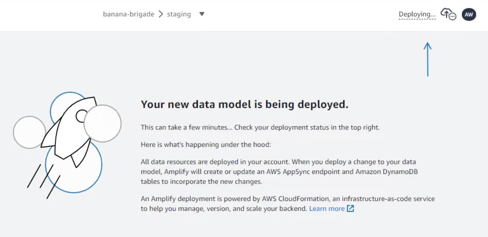

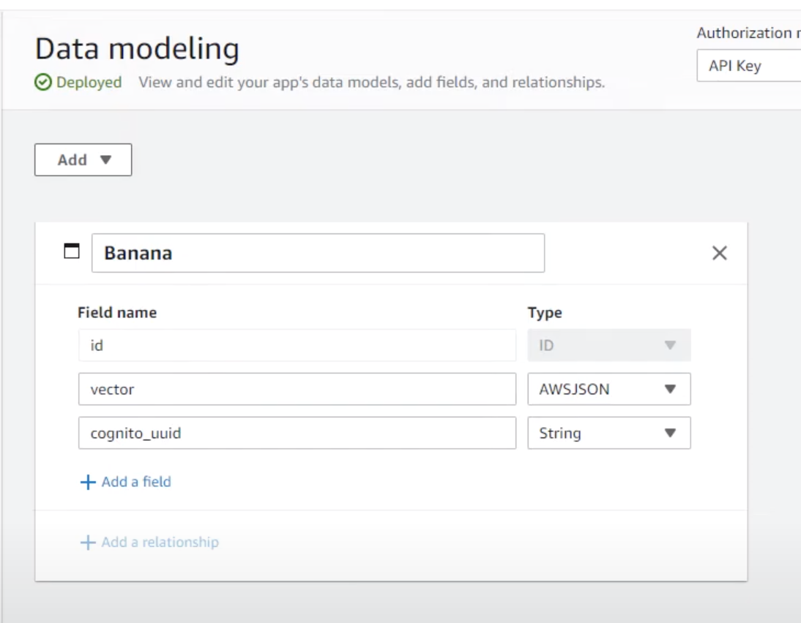

#### 2.4 Setup Authenication

We want to use Amazon Cognito to authenicate with our web-application

We will leave "Add login mechanism" to email.

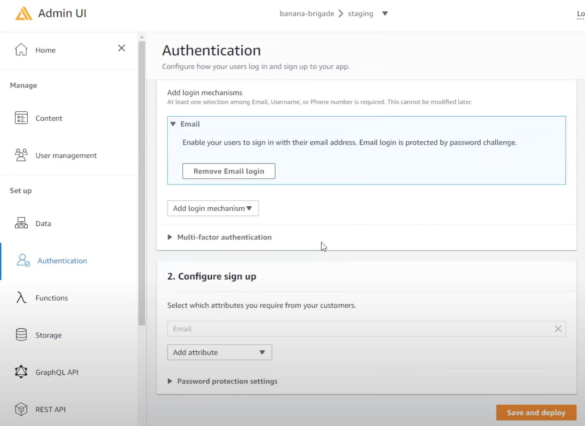

#### 2.5 Add Custom Attribute Nickname

We will want to store the User's Hashnode username, so let us use the
Nickname attribute

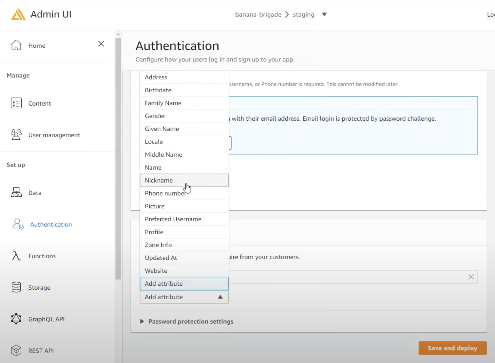

#### 2.6 Password Policy and Forgot Password

Let us make the password policy very easy for users since this is a non
critical app, where if someone were to access your account it wouldn't
matter.

We will switch Forget Password to Email since it is the cheaper option
over SMS.

Save and Deploy

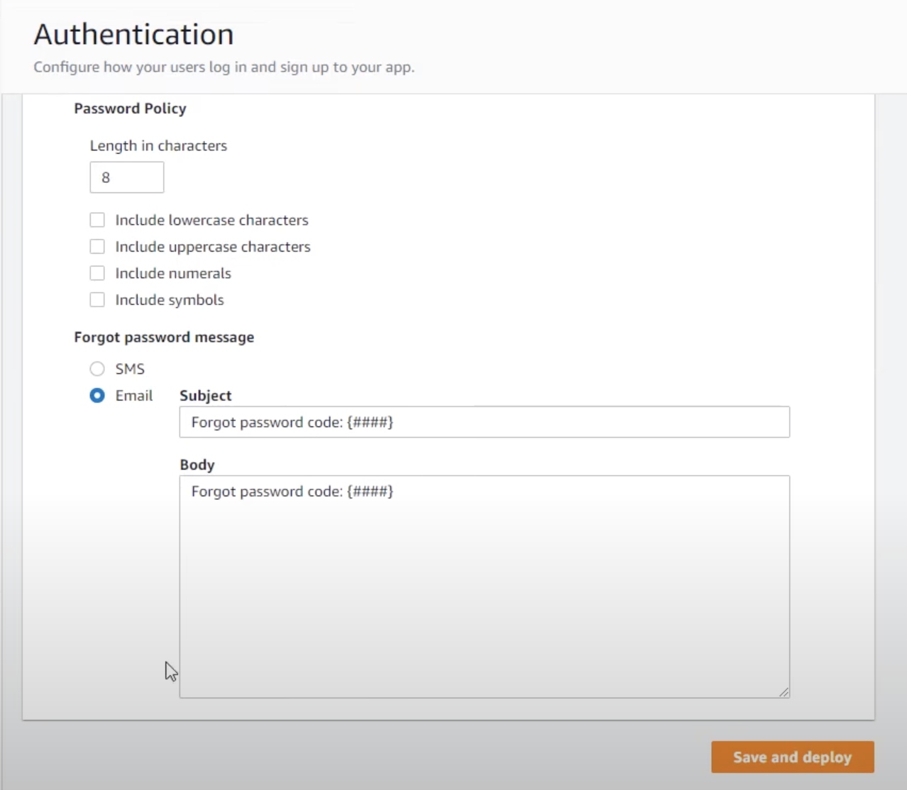


We will wait for the deploy to finish

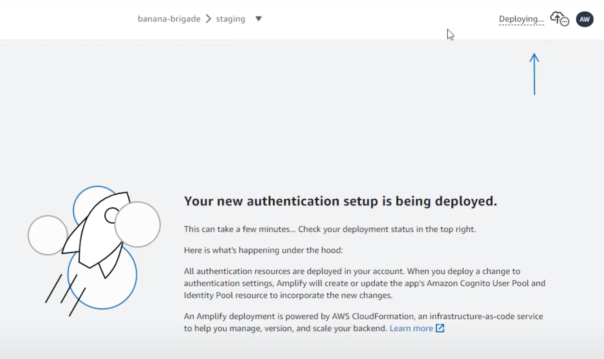


#### 2.7 Pull Amplify into Frontend application

In order for our frontend web-application to reference our AWS Amplify
backend we need an aws-exports.js.

We can pull this information by clicking the link in the right corner
taht shows our deployment status and copying the `amplify pull` commnad

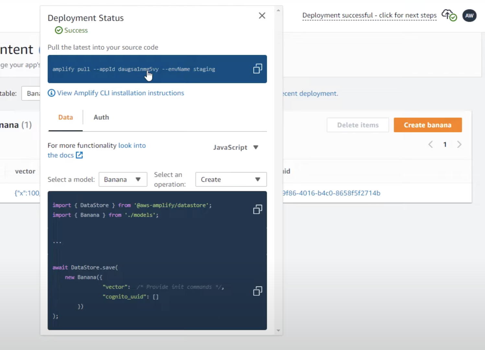

When we run this command it will ask us a series of questions.

The most important thing to remember is to choose `No` for do you plan
on modifiying your backend. We don't want to pull backend code, because
we want this to be low-code as possible.

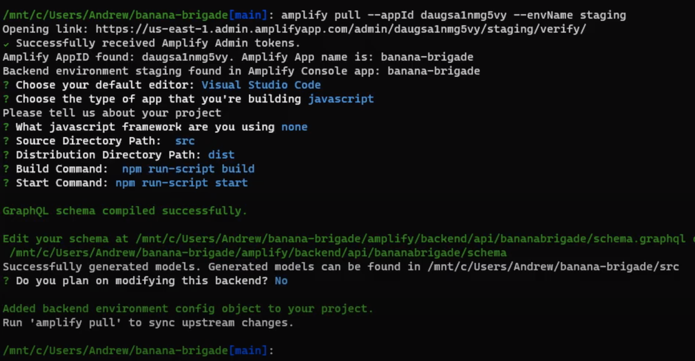


Make sure your `aws-exports.js` is in your `src` directory


### Deployment

This web-application is using continuous deployment via AWS Amplify Console.
When you push to main it will automatically trigger a deploy.
