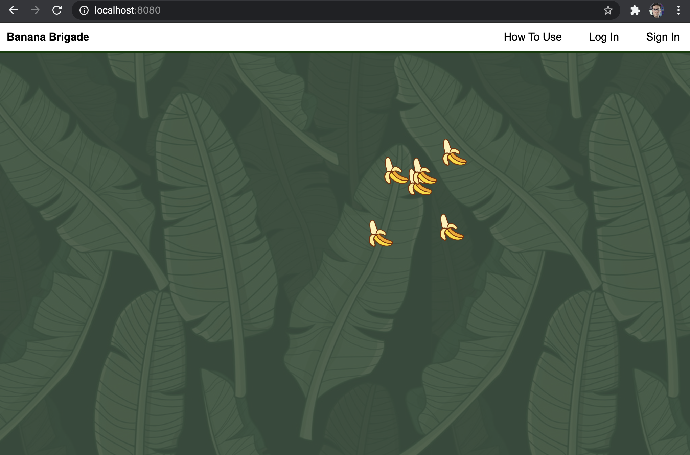
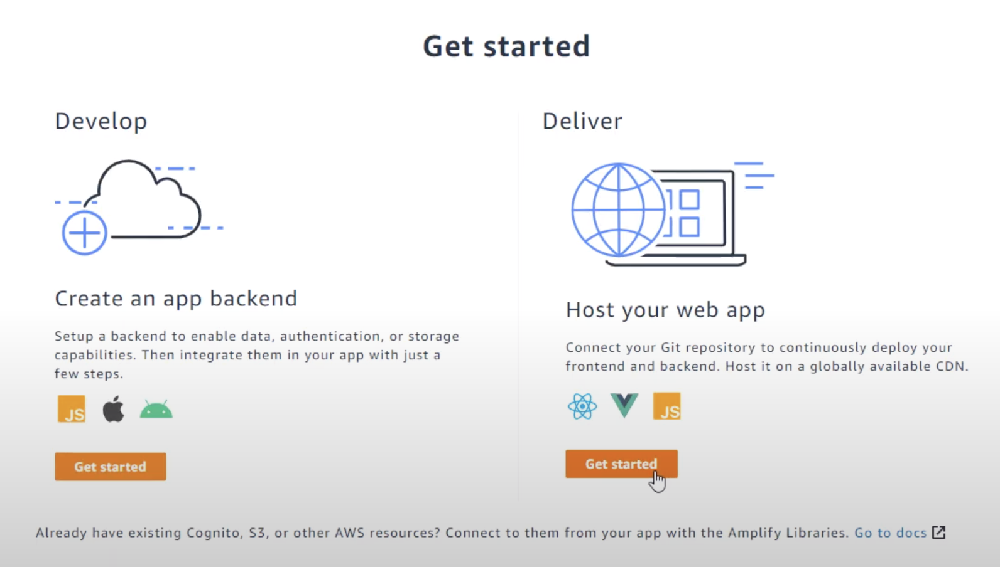
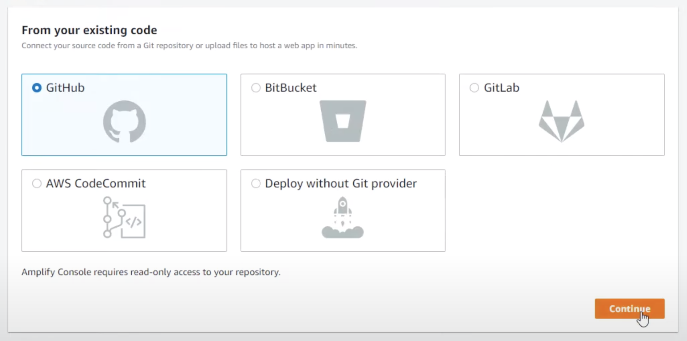
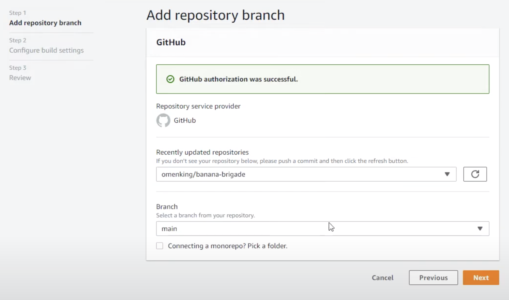
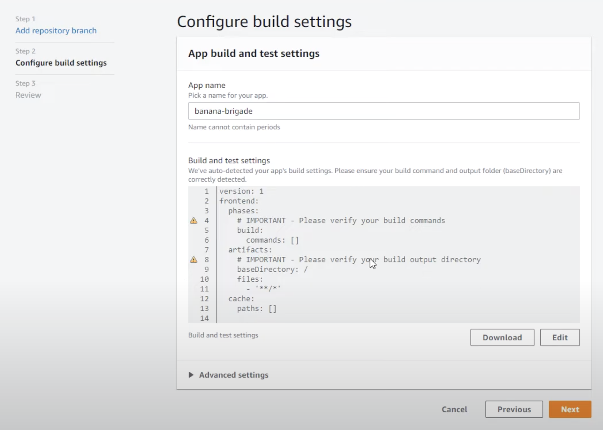
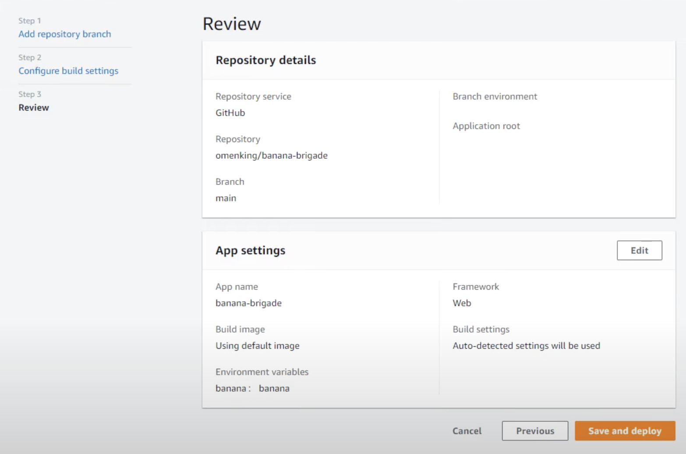

- [Business Goal](#business-goal)
- [Technical Goal](#technical-goal)
- [Working in Development](#working-in-development)
- [Provisioning Hosting, Backend and Deployment](#provisioning-hosting-backend-and-deployment)



## Business Goal

When a logged out user visits the web-app, they can see a screen full of bananas.
and when they hover over banana they will see the hashnode username of the person posting the banana

When a user clicks on Sign up they can create an accounts with an email, password and hashnode username.

When a user is logged in, they can left click to place upto 6 bananas onto the screen.
When the right click it will remove a banana. It would be nice to see bananas appear in real time.

## Technical Goal

Build a simple web-application that utilizes as much of the AWS Amplify Console using no javascript frameworks.

### Considersations

- Backend — The backend is built manually using the AWS Amplify Console Admin UI
- Hosting — The frontend is hosted via the AWS Amplify Console
- Frontend — The frontend is written in ES6 javascript, Scss and the Amplify Client, it was designed to be a simple use case to use Amplfiy without any javascript frameworks.

## Working in Development 

### Install Required Packages

```
npm i
```

### Running Local Web-server

Start the webpack development server.

```
npm start
```

Visit the url [http://localhost:8080/](http://localhost:8080/)

## Provisioning Hosting, Backend and Deployment

### 1. Getting Started (Setting up Frontend Hosting)

# 1.1 Host your web-app

We want to use AWS Amplify both for hosting our frontend and creating our backend via the Admin UI.
We will select `Get Started` for Host your Web app



# 1.2 Choose existing frontend from Github Repo

We are going to choose Github



# 1.3 Authorize and Connect

Authorize Github access by logging into your Github Account.
Choose the repo. In this case, for me it is omenking/banana-brigade



# 1.4 Name app and proceed

We'll name our app banana-brigade. Our repo doesn't have amplify build
file. No worries since we'll just go with the default settings and
proceed forward



# 1.5 Save and deploy

Save and deploy, wait a little bit



# 1.6 Wait for the frontend to deploy

Once deployed, AWS Amplify will be being to deploy the frontend.
Wait for it to complete it deploy.


Now we can procced to creating our backend.

### 2. AWS Amplify Admin UI (Setting up Backend Infrastructure)


### Deployment

This web-application is using continuous deployment via AWS Amplify Console.
When you push to main it will automatically trigger a deploy.
